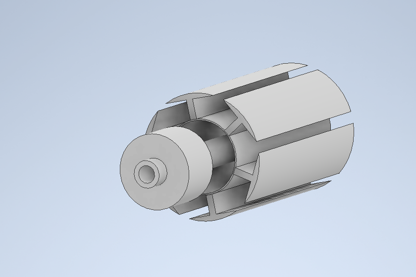

# DC Motor

> 9V DC Electric Motor designed to lift 100g in under 30 seconds. 



---

##  Table of Contents

- [About the Project](#about-the-project)
- [Features](#features)
- [Screenshots](#screenshots)
- [Getting Started](#getting-started)
- [Usage](#usage)
- [Contributing](#contributing)
- [License](#license)
- [Contact](#contact)

---

##  About the Project

Describe what the project does, why it exists, and any background context.

```markdown
This project aims to solve [problem] by providing [solution].
It was inspired by [motivation / idea].